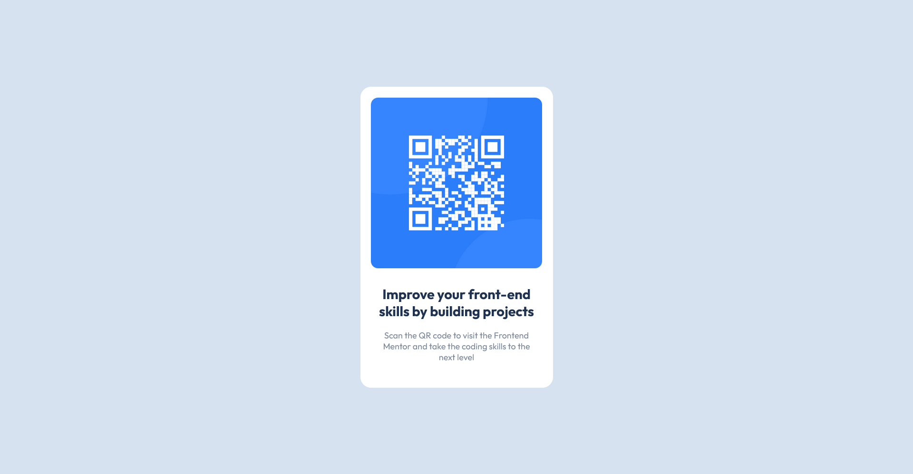

## Table of contents

-   [Overview](#overview)
-   [Screenshot](#screenshot)
-   [Links](#links)
-   [Built with](#built-with)
-   [Author](#author)

## Overview

This challenge is designed based on the provided template from Frontend Mentor which help us improve our coding skills by building realistic projects.

### Screenshot

### Links

-   Solution URL: [QR Code Component](https://github.com/Albrt78/frontend_mentor_project/tree/main/QR%20code%20component)
-   Live Site URL: [QR Code Component](https://albrt78.github.io/qrcodecomponent.github.io/)

### Built with

-   Semantic HTML5 markup
-   CSS custom properties

## Author

-   Frontend Mentor - [@Albrt78](https://www.frontendmentor.io/profile/Albrt78)
